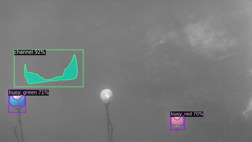
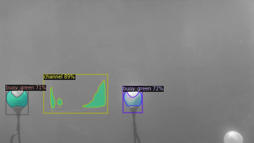

# Detectron2 On Robosub Dataset

This project was developed aiming to help in the object detection task of Autonomous Underwater Vehicle(AUV)
project in IIT(BHU) Varanasi.
We have used underwater images on fast-rcnn model. The results are very good. We hope to create more data points and enhance the detection even more.
 
## Model

This project is built on the Detectron2 software system by Facebook's AI Research team. Detectron2 is Facebook AI Research's next generation software system that implements state-of-the-art object detection algorithms. [Github](https://github.com/facebookresearch/detectron2)

## Dataset

Download the datasets :
  1. Training Set - 
  2. Validation Set - 

Source :- [Github](https://github.com/beaverauv/robosub_transdec_dataset)

## Results

 

## How to Run

Download the IPython Notebook and make necessary changes. Rest of it is self-explanatory.
